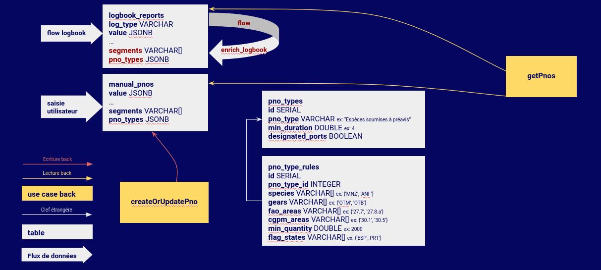

# Architecture de données et typage des préavis

Date: 27/02/2024

## Statut

Résolu.

## Contexte

Le développement de la brique de gestion des préavis dans Monitorfish, en remplacement de Trident qui assurait 
jusqu'ici cette gestion, nous amène à définir une **architecture de données** pour leur stockage en base de données
ainsi qu'une **stratégie de typage** permettant la catégorisation de ces préavis à des fins de lecture opérationnelle
rapide des préavis entrants.

**Concernant l'architecture** : les données provenant de deux sources différentes (logbook pour les préavis des navires
de plus de 12 m, saisie dans  Monitorfish pour les navires de moins de 12 m), il apparait naturel de stocker ces
données séparément dans une table correspondant à chaque source :
- la table `logbook_reports` déjà existante contient déjà les données de préavis qu'il s'agit ici d'exploiter pour les
  navires >= 12m
- une nouvelle table `manual_pnos` pour les préavis saisis dans Monitorfish

Le choix qui reste à faire concerne le mode de stockage de l'information de type : en effet, les critères de typage
(espèces, quantités...) correspondant à chaque type de préavis pouvant évoluer dans le temps, le format de stockage de
la donnée de type doit être défini en ayant en tête cette variabilité et les questions d'historisation qui en
découlent.

**Concernant le typage** : plusieurs contraintes rendent la tâche de typage non triviale :

- Les données sont entrées à des **temporalités différentes** (batch chaque minute pour les données logbook, temps réel
  au moment de la saisie pour les préavis saisis dans l'app)
- Les données sont écrites en base par des **composants différents** : un `flow` pour les données issues de logbook,
  le backend pour les données saisies dans l'app

Il faut donc définir quel(s) composant(s) (pipeline et / ou backend) ont la responsabilité du typage, et à quel moment
(précalcul avec stockage de l'information de type de chaque préavis, ou calcul à la volée au moment de la requête, sans
 stockage).

#### Stratégie #1 : typage précalculé en batch de tous les PNOs par la pipeline

Dans cette stratégie, c'est un `flow` de la pipeline qui ajoute l'information de type à la fois dans les PNO manuels et
dans les PNO issus de logbook.

La problématique d'historisation est traitée en stockant dans chaque PNO les informations liées au type.

Avantages :
- segments des marées passées disponibles
- performance en requête sur des préavis déjà typés
- réutilisation du code de typage par la pipeline pour les deux sources de données

Inconvénients :
- gestion d'un état transitoire en front entre le moment où un préavis est saisi et le moment où la pipeline lui a
  attribué un type
- complexité à gérer en cas de modification d'un préavis manuel : il faut signaler à la pipeline qu'il faut recalculer
  le type du préavis. De ce fait, une incertitude existe à tout moment sur l'exactitude de l'information de type des
  préavis manuels.

#### Option 2 : typage à la volée par le backend au moment de la requête

Dans cette stratégie, c'est au moment de la requête que les types de préavis sont calculés par le back.

Avantages :
- réutilisation du code de typage par le backend pour les deux sources de données
- pas de problème de latence entre saisie d'un préavis et attribution d'un type

Inconvénients :
- performances possiblement faibles sur des requêtes de larges plages de dates
- segments de flotte non disponibles sur préavis passés (uniquement segments de la marée en cours)

#### Option 3 : typage précalculé par la pipeline (données logbook) et par le backend (préavis manuels)

Dans cette stratégie :
- un `flow` de la pipeline ajoute l'information de type dans les PNO issus de logbook.
- le backend ajoute l'information de type dans les PNO manuels au moment de la saisie

Avantages :
- segments des marées passées disponibles
- performance en requête sur des préavis déjà typés
- pas de problème de latence entre saisie d'un préavis et attribution d'un type

Inconvénients :
- logique de typage à implémenter à la fois en backend et dans la pipeline

## Décision

La stratégie n°3 a été choisie afin d'avoir à la fois la performance y compris sur de larges volumes de données
passées, la disponibilité des données de segments des marées passées et éviter les problématiques de latence liées à la stratégie n°1.

.

## Conséquences

Il faudra tester exhaustivement les logiques de typage dans le backend et dans la pipeline pour s'assurer qu'elles
sont identiques.