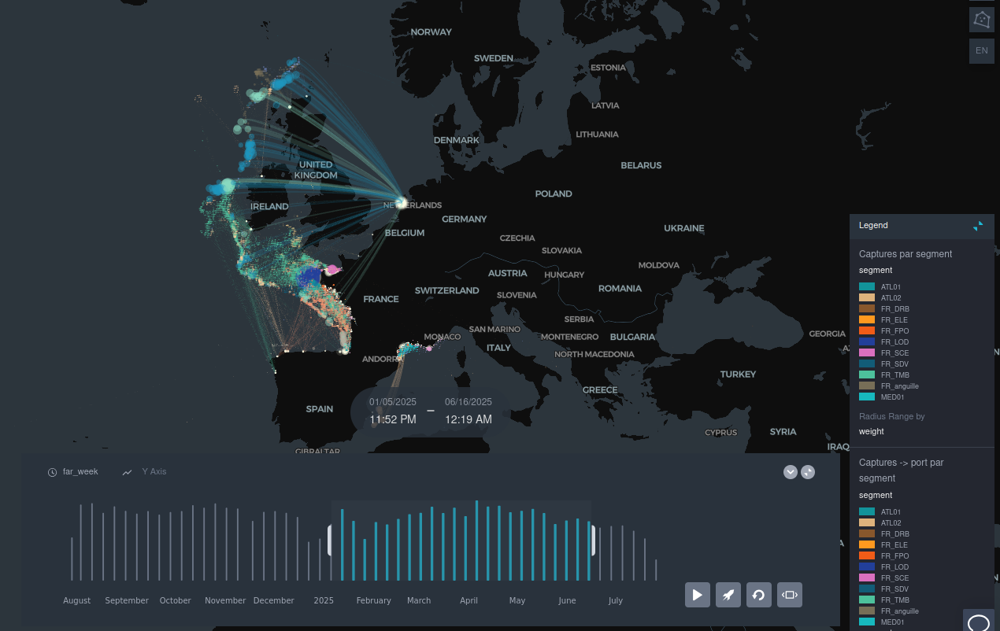

=================
Activity overview
=================

The declared activity data is aggregated to produce synthetic visualizations of catches and landings.

These visualizations are used to analyze the trends in activity - by fleet segment, by area, ... - and establish inspection plans following a risk-based methodology.