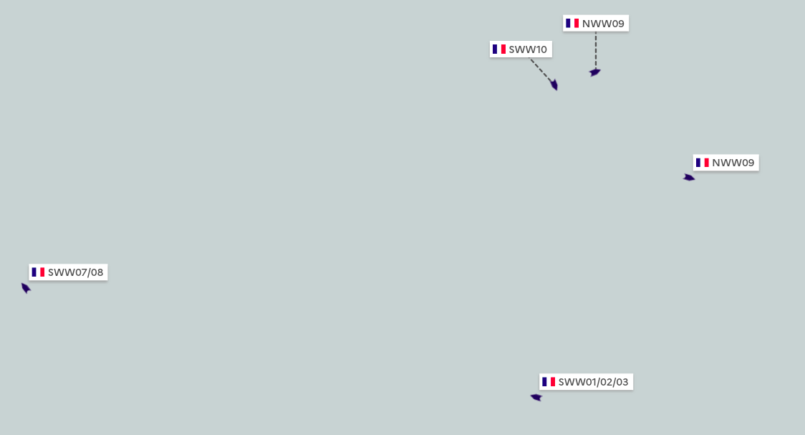

==============
Fleet segments
==============

The European Fishing Control Agency's `Guidelines on Risk Assessment Methodology <https://www.efca.europa.eu/en/content/guidelines-risk-assessment-methodology-fisheries-compliance>`_ 
define fleet segments as *'fishery units with similar fishing characteristics
(e.g., gear, area and target species)'*.

Each member state is responsible for defining the fleet segments relevant to its waters 
and to perform risk assessments on each segment.

.. _risk-assessment:

Fleet segment risk assessment and control objectives
----------------------------------------------------

In France, fleet segments were defined by the `Direction des Pêches Maritimes et de l'Aquaculture <https://agriculture.gouv.fr/administration-centrale>`_, 
and risk assessments on these fleet segments are performed each year by the 
`Directions Interrégionales de la Mer <https://fr.wikipedia.org/wiki/Direction_interr%C3%A9gionale_de_la_Mer#:~:text=Les%20directions%20interr%C3%A9gionales%20de%20la,marin%20et%20gestion%20des%20ressources>`_.

During this process, a risk level is computed for each fleet segment based on 

* scientific data on the **state of the stock** (healthy, threatened, collapsed...)
* national metrics to estimate the pressure that the fishing activity puts on the stock and the level of non-compliance observed on the fleet segment

In addition, and based on the risk assessment conclusions, an objective of a minimum number of controls to perform on each fleet segment is defined.

Fleet segments computation and display
--------------------------------------

The :doc:`flows/current-segments` flow computes the fleet segments each vessel belongs to in real time, based on ERS data.

Fishing vessels' fleet segment(s) can then be visualized on the map in real time, filtered based on their fleet segments...

