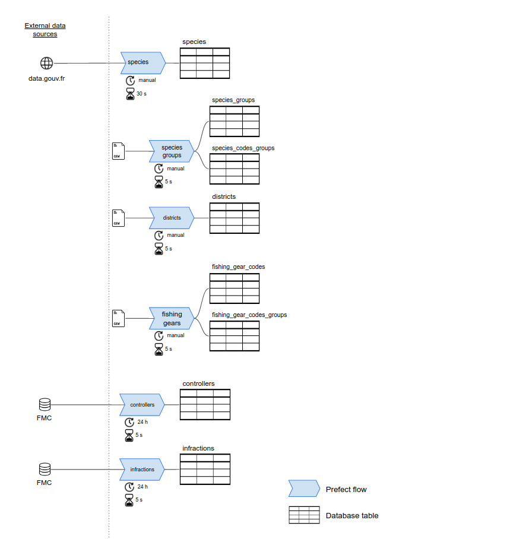
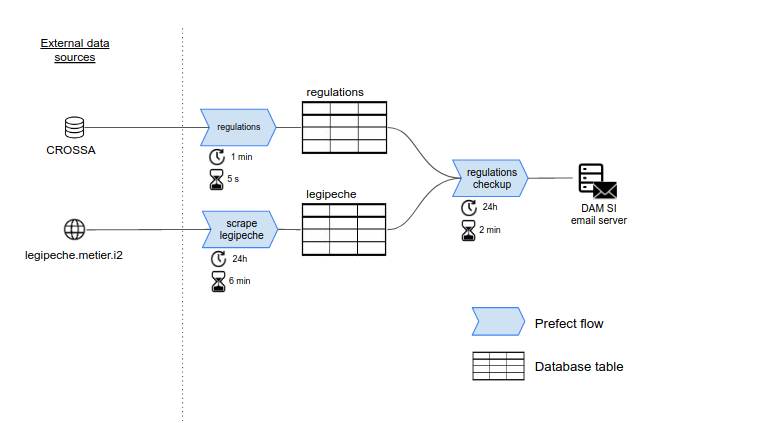
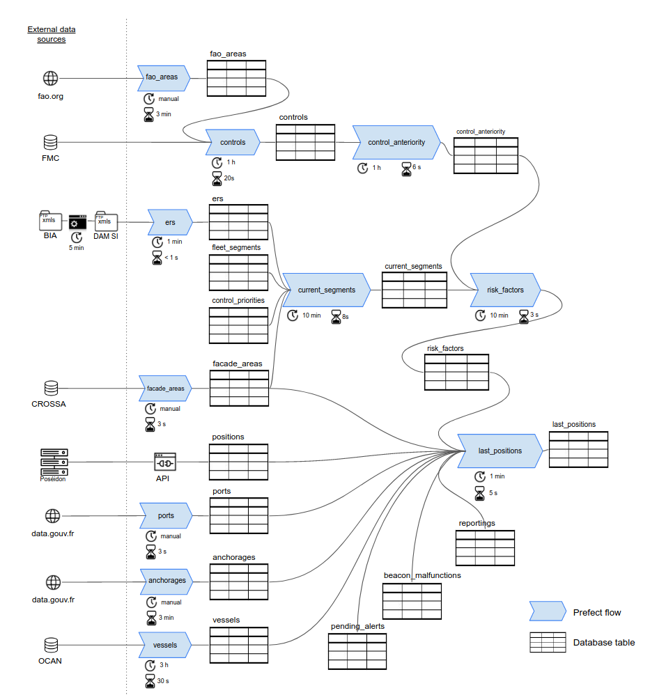

.. _flows:

=====
Flows
=====

What are flows?
===============

*Flows* are batch jobs that move and transform data. Collectively, they constitute the :ref:`data pipeline` part of 
the Monitorfish architecture.

Each batch job is written as a `Prefect flow <https://docs.prefect.io/core/concepts/flows.html#overview>`__
which typically extracts data  (from external sources and / or from tables in the 
Monitorfish database), processes the data and loads it back into a table of the Monitorfish database.

Flows are composed of `tasks <https://docs.prefect.io/core/concepts/tasks.html#overview>`__ typically written
as python pure functions. `The UI <http://prefect.csam.e2.rie.gouv.fr/>`__ (restricted access) enables 
administrators to view each flow as a diagram of its constituent tasks, to monitor their execution, see 
the logs and debug in case any flow run fails...

Overview of flows in Monitorfish
================================

Flow that imports administrative areas :

.. image:: _static/img/admin_areas_flows.png
  :width: 800
  :alt: Schematic of administrative areas data flow

Flows that import repositories (species, gears, infractions...) :

Flows that import and perform a check-up on regulations data :

Flows that perform computations that are internal to Monitorfish (alerts, fishing detection...):

.. image:: _static/img/alerts_and_internals_flows.png
  :width: 800
  :alt: Schematic of internal computations flows

Flows that contribute to maintaining an up-to-date `last_positions` table :

----

List of flows
=============

.. toctree::
    :maxdepth: 1

    flows/controllers
    flows/controls
    flows/current-segments
    flows/ers
    flows/fishing-gears
    flows/infractions
    flows/last-positions
    flows/ports
    flows/risk-factor
    flows/species
    flows/vessels