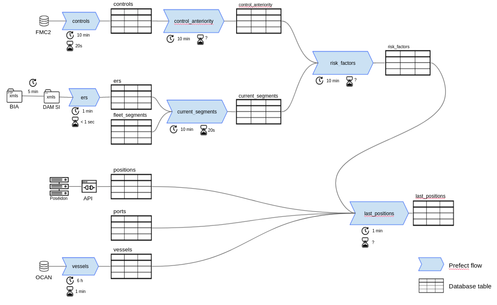

.. _flows:

=====
Flows
=====

Each batch job is written as a prefect `flow <https://docs.prefect.io/core/concepts/flows.html#overview>`__
which typically extracts data  (from external sources and / or from tables in the 
Monitorfish database), processes the data and loads it into a table of the Monitorfish database.

Flows are composed of `tasks <https://docs.prefect.io/core/concepts/tasks.html#overview>`__ typically written
as python pure functions. `The UI <http://prefect.csam.e2.rie.gouv.fr/>`__ (restricted access) enables 
administrators to view each flow as a diagram of its constituent tasks, to monitor their execution, see 
the logs and debug in case any flow run fails...

Overall view of data flows in Monitorfish :

.. toctree::
    :maxdepth: 2

    controllers
    controls
    current-segments
    ers
    fishing-gears
    infractions
    last-positions
    ports
    species
    vessels