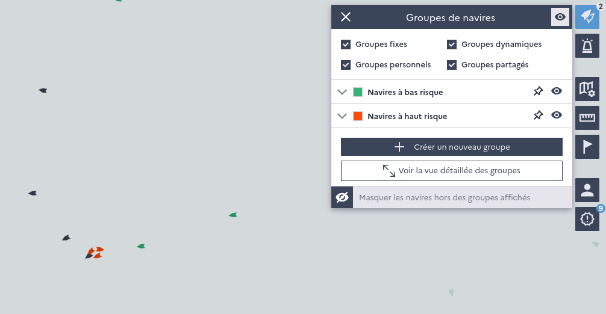

=================
Groups of vessels
=================

Groups of vessels can be created on various criteria (fleet segment, risk factor, gear, producer organization, vessel size, time since last inspection...).

Groups created by one user can be kept private or shared with other users. This functionality makes monitoring and targeting of fishing vessels on various criteria very flexible.