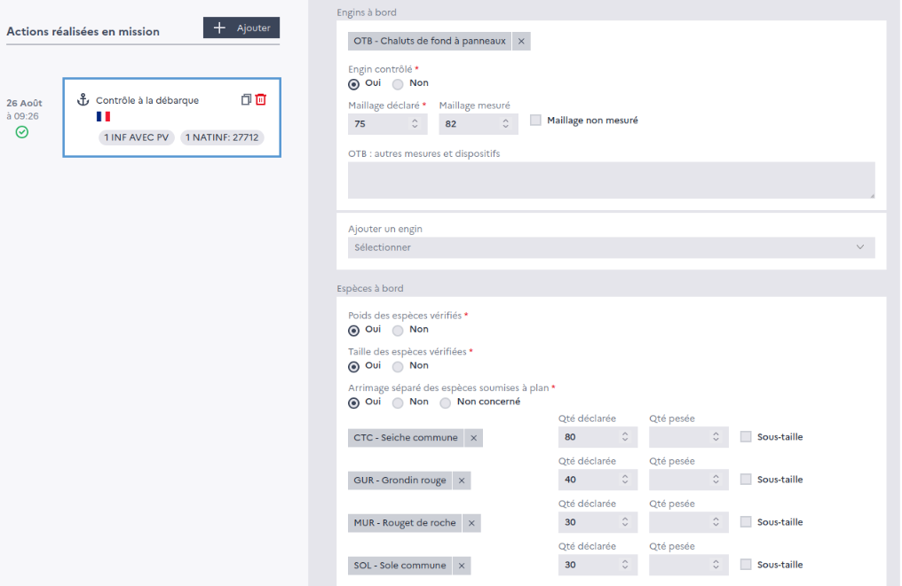

=====================
Inspection data entry
=====================

After each inspection, the inspection report is entered into a dedicated form.

This data is then visible on the inspection history of each vessel and used to compute the vessel's :doc:`risk-factor`.