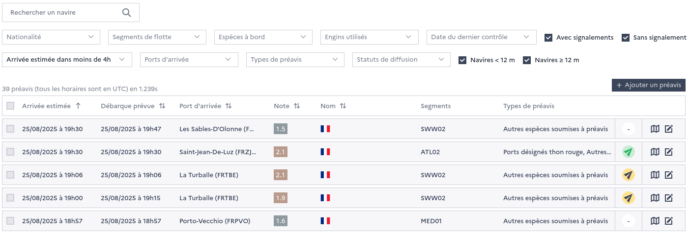

===================
Prior notifications
===================

Prior notifications of return to port can be monitored, checked, prioritized and sent to control units for targeted land inspections.

By default, the prioritization of prior notifications sent to control units for targeted inspections is based on the :doc:`risk factor <risk-factor>` and can be overidden by FMC supervisors for specific cases.