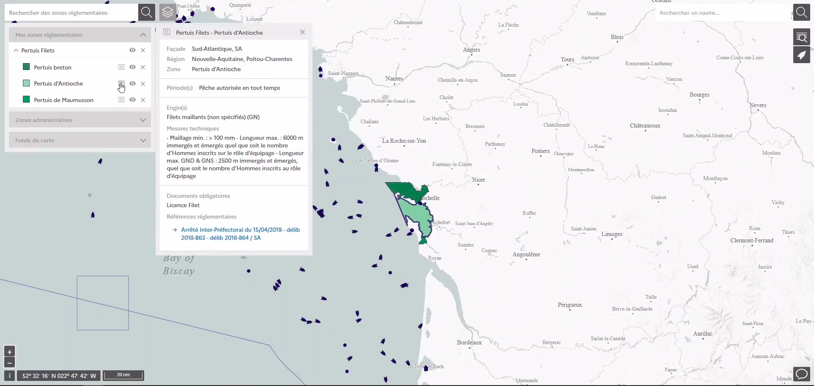

==========
Regulation
==========

A dedicated team of the FMC watches fishing regulation evolutions and captures 
it as semi-structured data in the admin panel of Monitorfish.

This data can be then displayed in Monitorfish to show regulated fishing areas.

The regulations data set is published and updated weekly on on data.gouv.fr : https://www.data.gouv.fr/datasets/reglementation-des-peches-cartographiee/