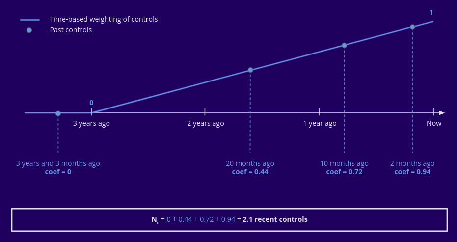

===========
Risk factor
===========

The risk factor is a metric computed for each vessel based its historical and real time data 
aimed at helping FMC agents prioritize vessels to control.

It is computed and constantly updated by the :doc:`flows/risk-factor` flow.

----

Principle
*********

In accordance with EFCA's `Guidelines on Risk Assessment Methodology <https://www.efca.europa.eu/en/content/guidelines-risk-assessment-methodology-fisheries-compliance>`_, 
the computation of the risk factor of each vessel is based on an estimatation of the *probability* that 
a given vessel is in a non-compliance situation and an estimation of the potential *impact* of the non-compliance.

In addition, in order to reflect the objective of FMCs to efficiently distribute control efforts 
across all segments and vessels in order to miminize the possibility of violations to go undetected, 
a third component of *detectability* is added, which measures how well distributed accross fleet segments and accross fishing vessels of each fleet segment.

The obtained metric is therefore analogous to the *risk priority number (RPN)* of the widely used `FMEA <https://en.wikipedia.org/wiki/Failure_mode_and_effects_analysis>`_ 
risk assessment methodology, in which *probability*, *severity* and *detectability* are the 3 components of the RPN.

Fishing vessels with higher risk factors constitute priority control target.

----

Computation
***********

Probability score
=================

The *probability* estimate of each fishing vessel is based on its historical control results.
Put simply, a fishing vessel which was caught many times in a situation of non-compliance in 
the past is estimated  to have a higher probability of future infringements than a fishing vessel 
which was historically controlled without non-compliance.

The computation is performed in two steps :

1. Computation of an infraction score
-------------------------------------

Taking into account control results of the last 5 years, the last 10 control results are assigned :

* a **score** equal to -1 if the control did not reveal any fishing non-compliance, and equal to 10 times the number of fishing violations committed if there were any
* a **coefficient** equal to 1 for the last control, 0.9 for the second-to-last control, ...

An **infraction score** is then computed as follows :

.. math::
    
    infraction\ score=\sum_{i=0}^{9}(1-\frac{i}{10})(10*I_i-\delta_{0I_i})

Where 

  | :math:`i` is the index of the control, from most recent (0) to least recent (9)
  | :math:`I_i` is the number of fishing infractions committed and picked up during the control :math:`i`
  | :math:`\delta_{0I_i}` is equal to 1 if :math:`I_i=0` and equal to 0 otherwise

This can be illustrated as follows :

2. Binning of the infraction score
----------------------------------

The *probability* component of the risk factor is defined based on the infraction score of the vessel :

================ =================
Infraction score Probability score
================ =================
< 0              1 (best)
0 - 11           2
11 - 21          3
> 21             4 (worst)
================ =================

A vessel that never committed any violation has a negative infraction score and therefore a probability score 
of 1, whereas a fishing vessel that committed many violations can have a score of more than 50 and will therefore 
have the highest probability score of 4.

In the above example, with the infraction score of 13.4, the vessel has a probability score of 3.

----

Impact score
============

The *impact* score is defined by taking the risk level of the :doc:`fleet segment <fleet-segments>` a fishing vessel belongs to in real time. 
This risk level represents the **impact of the fishing activity** and is evaluated each year for each fleet segment during the *risk assessment* process.

If a fishing vessel belongs to several fleet segments, its *impact score* is defined as the highest risk level among the fleet segments it belongs to.

.. _detectability-score:

----

Detectability score
===================

The *detectability* score is higher for vessels that have been little controlled over the past years and for vessels that 
belong to fleet segments that have a higher :doc:`control priority level <control-priority-steering>`. It is based on two 
components :

* the fishing vessel's fleet segment :doc:`control priority level <control-priority-steering>`
* the fishing vessel's :ref:`control level <control-level>`

.. _control-level:

Control level
-------------

A fishing vessel's control level is defined in two steps :

1. Time-base weighting of the number of controls
"""""""""""""""""""""""""""""""""""""""""""""

The controls of the past 3 years are counted with a linearly decreasing 
weight :

We thus obtain a **'number of recent controls'**.

2. Binning on the number of controls and time since the last control
""""""""""""""""""""""""""""""""""""""""""""""""""""""""""""""""""""

Based on the above *number of recent controls*, as well as on the date of the most recent control, 
the *control level* is defined by binning according to the following schema :

Detectability score computation
-------------------------------

The detectability score of the fishing vessel is simply the geometric mean between the fishing vessel's 
control level and the control priority level of its fleet segment(s).

.. math::
    
    detactability\ score=\sqrt{Vessel\ Control\ Level*Fleet\ Segment\ Control\ Priority\ Level}

Like for the impact score, of the vessel belongs to several fleet segments, the highest of the control priority 
levels is used, and if it does not belong to any fleet segment, the minimum control priority (1) is used.

----

Risk factor calculation
=======================

The risk factor is a weighted geometric mean of its 3 components :

.. math::
    
    risk\ factor= impact\ score^{0.2}*probability\ score^{0.3}*detectability\ score^{0.5}

The coefficients were adjusted based on workshops conducted with agents of the french FMC. Case studies using 
real data from the application were used to determine the importance of each factor in the FMC agents' judgement.