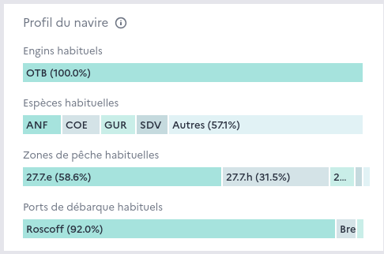

===============
Vessel profiles
===============

Vessel profiles are computed by aggregating each vessels' declarative data (catches, landings). 

Vessel profiles are a way to see the vessel's usual activity at a glance. This is useful to identify the likely activity of vessels for which no data is available in real time :

* vessels which are not subject to real time activity declaration in electronic logbooks
* trips that started less than 24 hours ago and for which no FAR has been emitted yet

Vessel profiles are also use for the computation of :doc:`risks factors <flows/risk-factor>`.