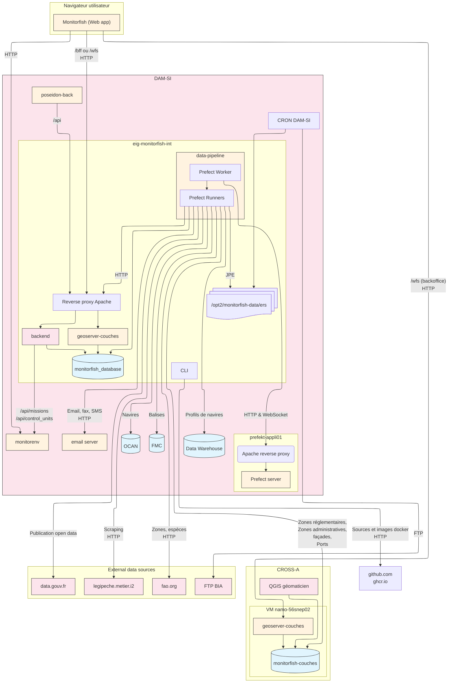

```mermaid
---
config:
  layout: elk
---
flowchart TB

 subgraph Web["Navigateur utilisateur"]
        App["Monitorfish (Web app)"]
  end
 subgraph Pipeline["data-pipeline"]
    Worker["Prefect Worker"]
    Runners["Prefect Runners"]
  end
 subgraph eig["eig-monitorfish-int"]
        Cli["CLI"]
        Apache["Reverse proxy Apache"]
        Backend["backend"]
        GeoserverC["geoserver-couches"]
        DB[("monitorfish_database")]
        Pipeline["data-pipeline"]
        JPE["/opt2/monitorfish-data/ers"]
        JPE@{ shape: docs}
  end
 subgraph Prefect["prefekt-appli01"]
        PrefectApache("Apache reverse proxy")
        PrefectApp["Prefect server"]
  end
 subgraph CrossA["VM namo-56snep02"]
        CrossGeoserver["geoserver-couches"]
        CrossDB[("monitorfish-couches")]
  end
 subgraph DAMSI["DAM-SI"]
        eig
        Monitorenv["monitorenv"]
        Poseidon["poseidon-back"]
        Prefect
        CronJPE["CRON DAM-SI"]
        Services["email server"]
        FMC[("FMC")]
        Ocan[("OCAN")]
        DW[("Data Warehouse")]
  end
 subgraph CROSSA["CROSS-A"]
        CrossA
        QGIS["QGIS géomaticien"]
  end
 subgraph external_systems["External data sources"]
        Legipeche["legipeche.metier.i2"]
        BIA["FTP BIA"]
        Datagouv["data.gouv.fr"]
        FAO["fao.org"]
  end
    App -- /bff ou /wfs<br>HTTP --> Apache
    App -- HTTP --> Monitorenv
    App -- /wfs (backoffice)<br>HTTP --> CrossGeoserver
    Apache --> Backend & GeoserverC
    Cli -- Sources et images docker<br>HTTP --> Github["github.com<br>ghcr.io"]
    Poseidon -- /api --> Apache
    Backend -- /api/missions<br>/api/control_units --> Monitorenv
    Backend --> DB
    GeoserverC --> DB
    CronJPE -- FTP --> BIA
    CronJPE --> JPE
    Runners --> DB
    Worker -- HTTP & WebSocket --> PrefectApache
    Worker --> Runners
    PrefectApache --> PrefectApp
    Runners -- JPE --> JPE
    Runners -- Scraping<br>HTTP --> Legipeche
    Runners -- Balises --> FMC
    Runners -- Profils de navires --> DW
    Runners -- Navires --> Ocan
    Runners -- HTTP --> Apache
    Runners -- Email, fax, SMS<br>HTTP --> Services
    Runners -- Zones, espèces<br>HTTP --> FAO
    Runners -- Publication open data --> Datagouv
    CrossGeoserver --> CrossDB
    QGIS --> CrossDB
    Runners -- Zones réglementaires,<br>Zones administratives,<br>façades,<br>Ports --> CrossDB
     App:::service
     Backend:::external
     GeoserverC:::service
     DB:::db
     Pipeline:::service
     PrefectApp:::service
     CrossGeoserver:::service
     CrossDB:::db
     DW:::db
     Monitorenv:::service
     Services:::service
     Poseidon:::service
     QGIS:::external
     FMC:::db
     Ocan:::db
     DAMSI:::external
     BIA:::external
     Datagouv:::external
     Legipeche:::external
     FAO:::external
    classDef server fill:#f9f9f9,stroke:#333,stroke-width:1px
    classDef db fill:#e1f5fe,stroke:#333,stroke-width:1px
    classDef service fill:#fff3e0,stroke:#333,stroke-width:1px
    classDef external fill:#fce4ec,stroke:#333,stroke-width:1px
```
