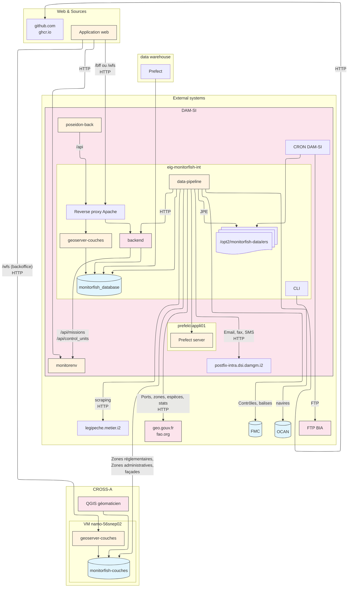

```mermaid
---
config:
  layout: elk
---
flowchart TB
 subgraph Left["Web & Sources"]
        App["Application web"]
        Github["github.com<br>ghcr.io"]
  end
 subgraph eig["eig-monitorfish-int"]
        Cli["CLI"]
        Apache["Reverse proxy Apache"]
        Backend["backend"]
        GeoserverC["geoserver-couches"]
        DB[("monitorfish_database")]
        Pipeline["data-pipeline"]
        JPE["/opt2/monitorfish-data/ers"]
        JPE@{ shape: docs}
  end
 subgraph Prefect["prefekt-appli01"]
        PrefectApp["Prefect server"]
  end
 subgraph PrefectDataWarehouse["data warehouse"]
        PrefectAppDataWarehouse["Prefect"]
  end
 subgraph CrossA["VM namo-56snep02"]
        CrossGeoserver["geoserver-couches"]
        CrossDB[("monitorfish-couches")]
  end
 subgraph DAMSI["DAM-SI"]
        eig
        Monitorenv["monitorenv"]
        Poseidon["poseidon-back"]
        Prefect
        CronJPE["CRON DAM-SI"]
        Services["postfix-intra.dsi.damgm.i2"]
  end
 subgraph CROSSA["CROSS-A"]
        CrossA
        QGIS["QGIS géomaticien"]
  end
 subgraph Right["External systems"]
        FMC[("FMC")]
        Legipeche["legipeche.metier.i2"]
        Ocan[("OCAN")]
        DAMSI
        BIA["FTP BIA"]
        GeoData["geo.gouv.fr<br>fao.org"]
  end
    App -- /bff ou /wfs<br>HTTP --> Apache
    App -- HTTP --> Monitorenv
    App -- /wfs (backoffice)<br>HTTP --> CrossGeoserver
    Apache --> Backend & GeoserverC
    Cli -- HTTP --> Github
    Poseidon -- /api --> Apache
    Backend -- /api/missions<br>/api/control_units --> Monitorenv
    Backend --> DB
    GeoserverC --> DB
    CronJPE -- FTP --> BIA
    CronJPE --> JPE
    Pipeline --> DB & PrefectApp
    Pipeline -- JPE --> JPE
    Pipeline -- scraping<br>HTTP --> Legipeche
    Pipeline -- Contrôles, balises --> FMC
    Pipeline -- navires --> Ocan
    Pipeline -- HTTP --> Backend
    Pipeline -- Email, fax, SMS<br>HTTP --> Services
    Pipeline -- Ports, zones, espèces, stats<br>HTTP --> GeoData
    CrossGeoserver --> CrossDB
    QGIS --> CrossDB
    PrefectAppDataWarehouse --> DB
    Pipeline -- Zones réglementaires,<br>Zones administratives,<br>façades --> CrossDB
     App:::service
     Backend:::external
     GeoserverC:::service
     DB:::db
     Pipeline:::service
     PrefectApp:::service
     CrossGeoserver:::service
     CrossDB:::db
     Monitorenv:::service
     Poseidon:::service
     QGIS:::external
     FMC:::db
     Ocan:::db
     DAMSI:::external
     BIA:::external
     GeoData:::external
    classDef server fill:#f9f9f9,stroke:#333,stroke-width:1px
    classDef db fill:#e1f5fe,stroke:#333,stroke-width:1px
    classDef service fill:#fff3e0,stroke:#333,stroke-width:1px
    classDef external fill:#fce4ec,stroke:#333,stroke-width:1px

```
