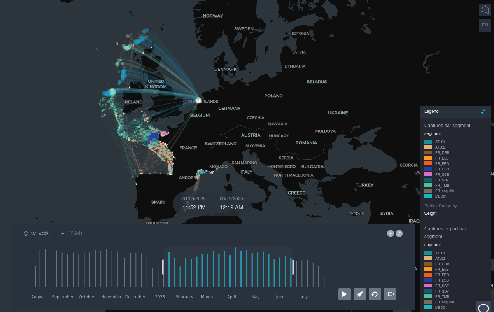

=================
Activity overview
=================

The declared activity data is aggregated to produce synthetic visualizations of catches and landings of all vessels.

These visualizations are used to analyze the trends in activity - by fleet segment, by area, ... - and establish inspection 
plans following a risk-based methodology.

The visualization is opened from the *"Données d'activité"* button of the map, in a new tab. It covers the last 12 months of 
data (catches by position or by statistical rectangle, linked to landing ports) and is updated every month by the 
:doc:`flows/activity-visualizations` flow. It is enabled depending on the deployment.
