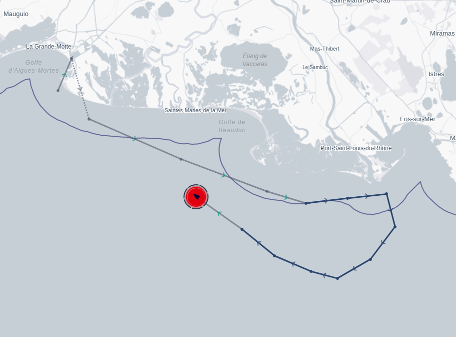
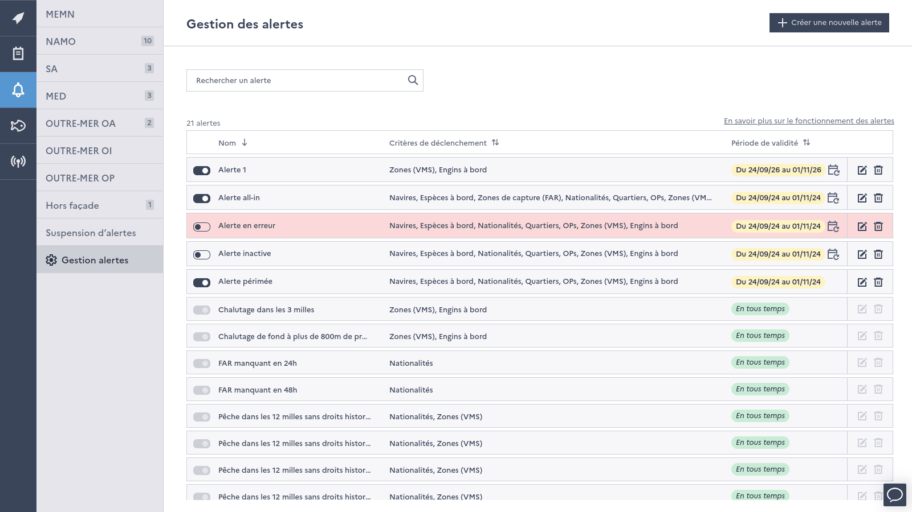
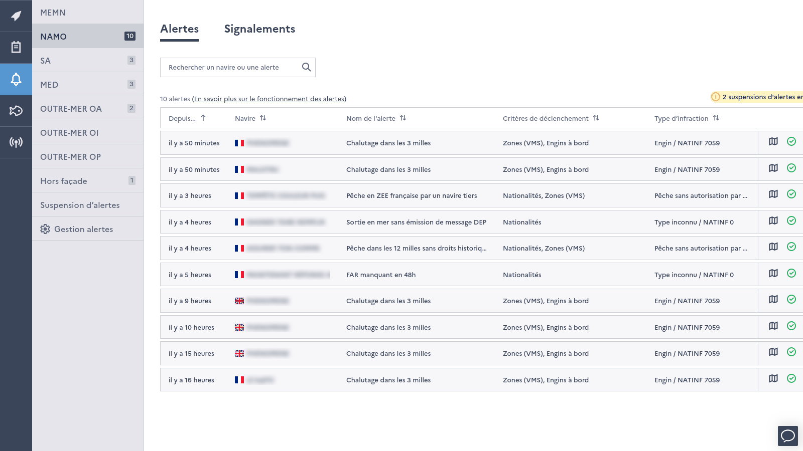

======
Alerts
======

Monitorfish performs **real time fraud detection** using VMS, logbook and regulations data. When signs of fraud are 
detected on a vessel, it appears on the map with a red halo :

*Map showing a vessel's VMS track which presents signs of illegal trawling in the 3 nautical miles coastal strip*

Alerts are available to super users. A dialog in the app (*"Comment fonctionnent les alertes"*) explains how each alert works.

Types of alerts
---------------

Monitorfish detects two kinds of alerts.

**Alerts on logbook declarations**, computed by dedicated flows of the data pipeline :

* undeclared departure at sea : VMS track showing a departure at sea with no corresponding Departure (DEP) declaration in 
  the electronic logbook (:doc:`flows/missing-dep-alerts`)
* undeclared fishing activity : VMS track showing fishing activity with no corresponding Fishing Activity Report (FAR) in 
  the electronic logbook within 24 hours or 48 hours (:doc:`flows/missing-far-alerts`)
* suspicion of under-declaration : fishing effort non consistent with declared quantities (:doc:`flows/suspicions-of-under-declaration-alerts`)

**Position alerts**, which detect vessels whose VMS positions match a set of criteria (see :ref:`configurable-alerts`). 
Monitorfish comes with predefined position alerts, for instance :

* trawling in the french 3 nautical miles coastal strip
* fishing in the french 12 nautical miles coastal strip by a non-french vessel (excluding historic fishing rights for certain states)
* fishing in the french Exclusive Economic Zone (EEZ) by a non-Community vessel
* fishing in a Real Time Closure (RTC) area
* fishing in the NEAFC area (subject to authorization by NEAFC)
* exceeding the maximum authorized blue ling (BLI) quantity held onboard in area 27.6.a

and users can create their own alerts, to detect ad-hoc behaviour or to focus monitoring on a certain area, species or fleet.

.. _configurable-alerts:

Configurable alerts
-------------------

The *"Gestion des alertes"* page of the side window lists all position alerts, which can be searched, activated, 
deactivated, created, edited and deleted. An alert is defined by :

* its name, description, NATINF code and threat (used to categorize the resulting reportings)
* the zones of detection : administrative zones (EEZ, FAO areas, coastal strips...) and / or regulatory zones
* the vessels concerned : flag states, districts, producer organizations or individual vessels
* gears onboard (with an optional mesh range) and species onboard (with an optional minimum weight and catch areas)
* the positions taken into account : all positions or only positions with fishing activity, over a number of hours, 
  with an optional minimum depth
* its validity period, which can be repeated each year
* whether the resulting reportings are automatically archived when the vessel starts a new trip, and whether the alert 
  is automatically deleted at the end of its validity period

Activated alerts are run every 10 minutes by the :doc:`flows/position-alerts` flow.

*List of configurable alerts ("Gestion des alertes")*

Alert lifecycle
---------------

Pending alerts are listed in the side window, grouped by seafront (MEMN, NAMO, SA, MED, overseas territories...). 
Alerts are humanly checked and can be :

*Pending alerts of the NAMO seafront*

* **validated** : the alert becomes a :doc:`reporting <reportings>`, stored in the vessel's history
* **silenced** : the alert is suspended for this vessel until a chosen date (the list of suspended alerts is available in the 
  *"Suspension d'alertes"* page)
* **deleted**, when the alert is not relevant

Some alerts with a high number of occurrences (e.g. *Missing FAR in 24h*) are automatically validated by the 
:doc:`flows/validate-pending-alerts` flow.

Alerts make use of the fishing detection algorithm of the :doc:`enrich position flow <flows/enrich-positions>`.
