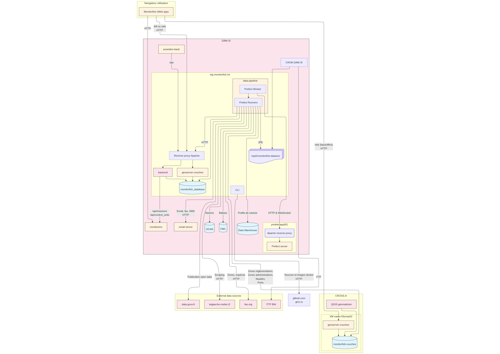

============
Architecture
============

Monitorfish is built around 3 main components, and integrates with several external systems :

.. contents::
    :local:
    :depth: 1

It receives and collects data from several external systems. This diagram gives an overview of the entire system :

The following sections give more details about the backend, frontend and data pipeline components.

----

.. _back-end:

Back end
********

* Kotlin 2.4 on the JVM 21, built with Gradle
* Spring Boot 4.1
* Flyway (database migrations, run at startup)
* PostgreSQL with PostGIS/TimescaleDB

The backend follows a clean architecture : business logic is written as *use cases* (``domain/use_cases``) which 
are exposed by API controllers and use repositories implemented in the ``infrastructure`` layer.

APIs
----

* ``/bff/v1/*`` : the API used by the frontend (*backend for frontend*). It requires an authenticated and authorized 
  user (see :doc:`authentication`). Some routes (missions, alerts, reportings, beacon malfunctions, back office...) are 
  restricted to super users (see :doc:`access-rights`).
* ``/api/v1/*`` : the API used by other systems, notably :

  * ``POST /api/v1/positions`` to receive VMS positions (NAF format)
  * ``/api/v1/mission_actions`` used by Monitorenv and RapportNav to read and update the controls of a mission (API key)
  * ``/api/v1/beacon_malfunctions`` and ``/api/v1/authorization/management`` (API key)
  * read-only referentials (vessels, ports, infractions) and the ``/api/v1/healthcheck`` endpoint

* ``/swagger-ui`` : the OpenAPI documentation of these APIs.

Scheduled jobs
--------------

In addition to the :ref:`data pipeline <data-pipeline>`, the backend runs a few scheduled jobs every 5 minutes :

* archiving outdated :doc:`reportings <reportings>` (after a new trip, at the end of their validity, or at the next departure)
* deleting :ref:`configurable alerts <configurable-alerts>` at the end of their validity period, when requested
* invalidating outdated "zero" BFT/SWO manual :doc:`prior notifications <prior-notifications>` after 24 hours

----

Front end
*********

* React, TypeScript, built with Vite
* OpenLayers for maps
* Redux Toolkit and RTK Query for state management and API calls
* `Monitor UI <https://github.com/MTES-MCT/monitor-ui>`__, the design system shared with Monitorenv

The frontend is a single page application served by the backend. It has two windows : the main window (map) and the 
*side window* (lists, forms and kanbans opened in a separate browser window).

----

.. _data-pipeline:

Data pipeline
*************

The data processing service executes python batch jobs to :

* pull data from external sources into the Monitorfish database (ETL)
* process data in the Monitorfish database to enrich and update tables that the backend makes available to the frontend through an API
* publish data online

Database schema
---------------

Database tables are created by the :ref:`back-end`. Jobs of the data pipeline require tables to already exist and to have the right
columns and data types. It is therefore necessary to keep the back end and the data pipeline applications "in sync". 
For this reason, the back end and the data pipeline should always be deployed with the **same version number** (see :ref:`environment_variables`).

Orchestration
-------------

Batch jobs are orchestrated by `Prefect <https://prefect.io>`__. For more information see 
`Prefect documentation <https://docs.prefect.io/v3/get-started/>`__.

The prefect UI enables administrators to monitor their execution, see the logs and debug in case any flow run fails...

Execution
---------

Stack
"""""

The main tools used to extract data, process it in python and load it to the PostgreSQL database of Monitorfish are :

* python 3.14
* `SQLAlchemy <https://www.sqlalchemy.org/>`__ as a python SQL toolkit to interact with SQL databases
* Database adapters `python-oracledb <https://python-oracledb.readthedocs.io/>`__,  `psycopg2 <https://github.com/psycopg/psycopg2/>`__ and `ClickHouse Connect <https://clickhouse.com/docs/integrations/python/>`__ for 
  connectivity to Oracle, PostgreSQL and ClickHouse databases respectively
* `pandas <https://pandas.pydata.org/>`__ and `DuckDB <https://duckdb.org/>`__ for data manipulation in python
* the `prefect python library <https://github.com/prefecthq/prefect>`__ to write batch jobs as flows of tasks

Flows : one for each job
""""""""""""""""""""""""

Batch jobs are written in python as prefect :ref:`flows <flows>` : each flow is responsible
for one particular task, such as updating the ``vessels`` referencial or refreshing the table of ``last_positions``.

Execution in a dockerized service
"""""""""""""""""""""""""""""""""

A `prefect worker <https://docs.prefect.io/v3/concepts/workers>`__ constantly polls the Prefect API in order to know if any flow must be executed. 
When a flow must be executed, the Prefect server tells the worker, which spawns a runner that runs the flow in an ephemeral docker container.

----

.. _integrations:

Integrations with other systems
*******************************

==========================================  ===================================================================================================
System                                      Usage
==========================================  ===================================================================================================
VMS (FMC2)                                  VMS positions are pushed to the backend API ; beacons data is imported by the :doc:`flows/beacons` flow
AIS                                         AIS positions are consumed by the backend from a Kafka topic (``monitor.ais.position``)
Logbook (ERS / FLUX) and sales notes        Zip files are ingested by the :doc:`flows/sales-and-logbook` flow
Monitorenv                                  Missions, control units and stations are read from the Monitorenv API ; Monitorenv reads and writes
                                            the controls of missions through the Monitorfish public API
RapportNav                                  The backend reads RapportNav to know whether a mission has actions filled in RapportNav ;
                                            RapportNav reads the controls of missions through the Monitorfish public API
GeoServer                                   Serves the administrative and regulatory zones layers to the frontend (WFS / WMS) ;
                                            regulations edited in the back office are written to the regulations database with WFS-T
ProConnect / Cerbère (OIDC)                 User authentication, see :doc:`authentication`
Email, SMS and fax gateways                 Used by the data pipeline to send prior notifications, beacon malfunction notifications and reports
data.gouv.fr and Géoplateforme              Open data publication (ports, controls, fleet segments, regulations), see :doc:`data-sources`
Sentry                                      Error monitoring of the backend and frontend
==========================================  ===================================================================================================

Note that the backend never sends messages itself : it sets flags in the database (e.g. a prior notification to send, 
a beacon malfunction notification requested) which are processed by the data pipeline.
