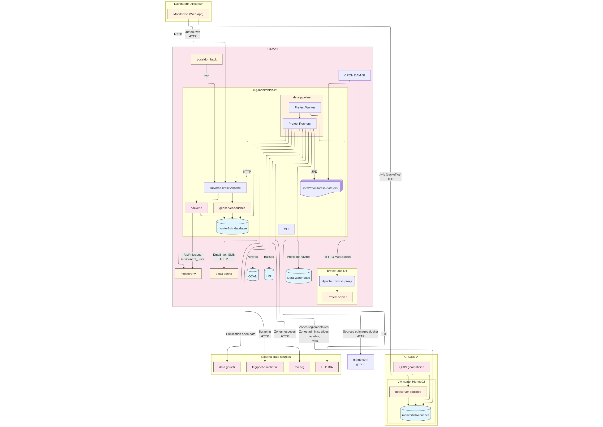

============
Architecture
============

Monitorfish is built around 3 main components :

.. contents::
    :local:
    :depth: 1

It receives and collects data from several external systems. This diagram gives an overview of the entire system :

The following sections give more details about the backend, frontend and data pipeline components.

----

.. _back-end:

Back end
********

* Kotlin
* Spring Boot
* Flyway (database migration)
* PostgreSQL with PostGIS/TimescaleDB
* Tomcat (version 9.0.37)

----

Front end
*********

* Openlayers
* React

----

.. _data-pipeline:

Data pipeline
*************

The data processing service executes python batch jobs to :

* pull data from external sources into the Monitorfish database (ETL)
* process data in the Monitorfish database to enrich and update tables that the backend makes available to the frontend through an API
* publish data online

Database schema
---------------

Database tables are created by the :ref:`back-end`. Jobs of the data pipeline require tables to already exist and to have the right
columns and data types. It is therefore necessary to keep the back end and the data pipeline applications "in sync". 
For this reason, the back end and the data pipeline should always be deployed with the **same version number** (see :ref:`environment_variables`).

Orchestration
-------------

Batch jobs are orchestrated by `Prefect <https://prefect.io>`__. For more information see 
`Prefect documentation <https://docs.prefect.io/v3/get-started/>`__.

The prefect UI enables administrators to monitor their execution, see the logs and debug in case any flow run fails...

Execution
---------

Stack
"""""

The main tools used to extract data, process it in python and load it to the PostgreSQL database of Monitorfish are :

* python 3
* `SQLAlchemy <https://www.sqlalchemy.org/>`__ as a python SQL toolkit to interact with SQL databases
* Database adapters `cx_Oracle <https://oracle.github.io/python-cx_Oracle/>`__,  `psycopg2 <https://github.com/psycopg/psycopg2/>`__ and `ClickHouse Connect <https://clickhouse.com/docs/integrations/python/>`__ for 
  connectivity to Oracle, PostgreSQL and ClickHouse databases respectively
* `pandas <https://pandas.pydata.org/>`__ and `DuckDB <https://duckdb.org/>`__ for data manipulation in python
* the `prefect python library <https://github.com/prefecthq/prefect>`__ to write batch jobs as flows of tasks

Flows : one for each job
""""""""""""""""""""""""

Batch jobs are written in python as prefect :ref:`flows <flows>` : each flow is responsible
for one particular task, such as updating the ``vessels`` referencial or refreshing the table of ``last_positions``.

Execution in a dockerized service
"""""""""""""""""""""""""""""""""

A `prefect worker <https://docs.prefect.io/v3/concepts/workers>`__ constantly polls the Prefect API in order to know if any flow must be executed. 
When a flow must be executed, perfect server tells the worker, which spawns a runner that runs the flow in an ephemeral docker container.
