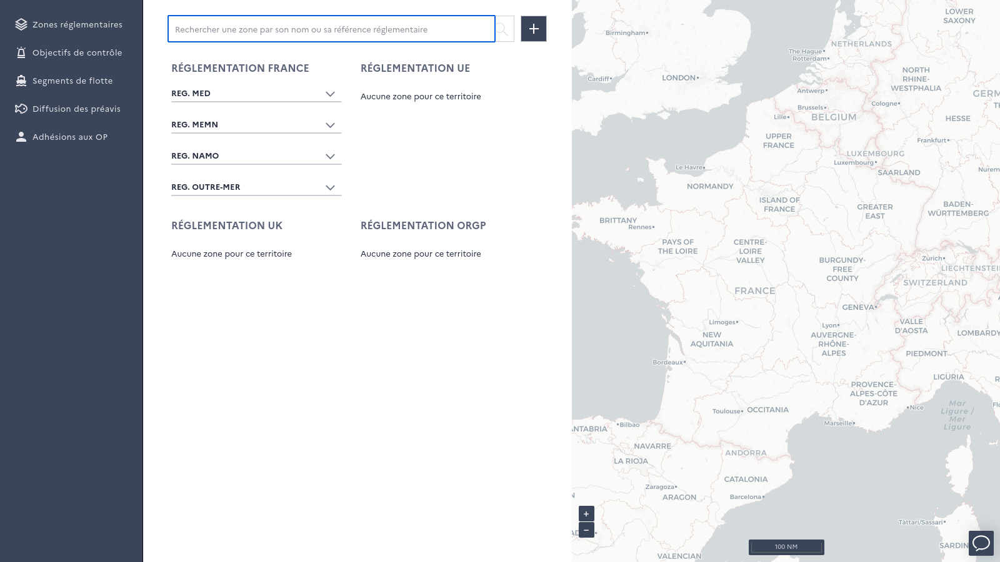
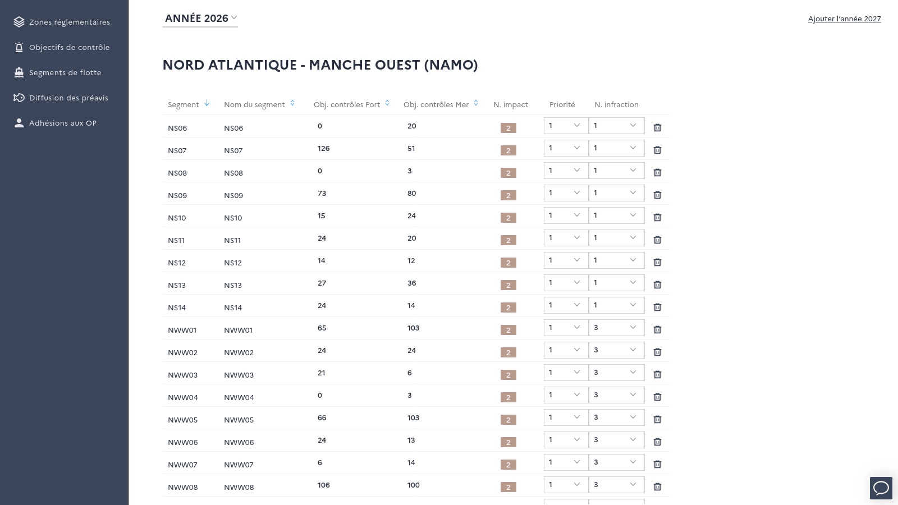
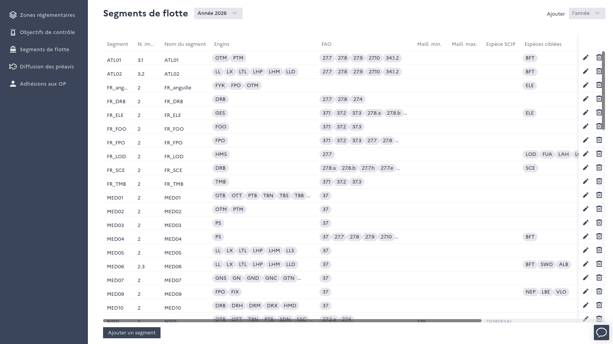

===========
Back office
===========

The back office is restricted to super users. It allows to manage the reference data used by Monitorfish :

*Regulatory zones in the back office*

* **regulatory zones** (*"Zones réglementaires"*) : create and update regulated fishing areas - geometry, regulatory references, 
  authorized or prohibited gears and species, fishing periods... See :doc:`regulation`.
* **control objectives** (*"Objectifs de contrôle"*) : set, for each year, seafront and fleet segment, the number of sea and land 
  controls to perform and the control priority level. See :doc:`control-priority-steering`.
* **fleet segments** (*"Segments de flotte"*) : define the fleet segments of each year - gears, target species, mesh, FAO areas, 
  vessel types, impact risk factor... A new year can be initialized from the segments of the previous year. See :doc:`fleet-segments`.
* **prior notification distribution** (*"Diffusion des préavis"*) : define which prior notifications are sent to each control 
  unit. See :doc:`control-units`.
* **producer organization memberships** (*"Adhésions aux OP"*) : record the producer organization of vessels, used to filter 
  the :doc:`vessel list <vessel-list>` and in :ref:`configurable alerts <configurable-alerts>`.

*Control objectives of a seafront for the current year*

*Definitions of fleet segments for the current year*
