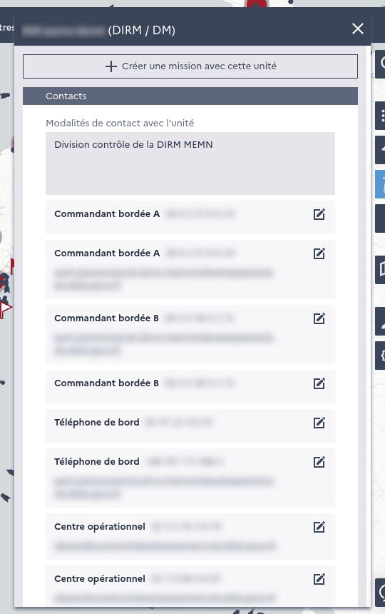
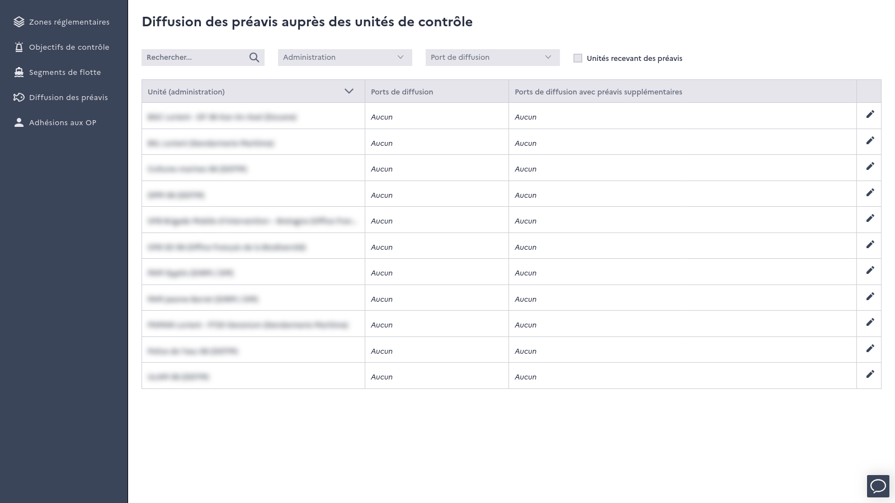

=============
Control units
=============

Control units (shared with Monitorenv) can be listed and searched by administration and resource type from the map. The card
of each control unit shows :

* its resources (vessels, aircrafts...) and their bases
* its contacts, and which contacts receive the notifications sent by Monitorfish
* its intervention area and contact methods

The stations of control units can be displayed on the map.

*Card of a control unit*

Prior notification distribution
-------------------------------

In the :doc:`back office <back-office>`, the *"Diffusion des préavis"* menu allows to define which :doc:`prior notifications <prior-notifications>`
are sent to each control unit, by :

* port of landing (all prior notifications, or only those which need to be verified by the FMC)
* fleet segment
* vessel

*Prior notification distribution to control units, in the back office*

Prior notifications are then sent by email and SMS by the :doc:`flows/distribute-pnos` flow. A weekly summary of 
their actions is also sent to control units by the :doc:`flows/email-actions-to-units` flow.
