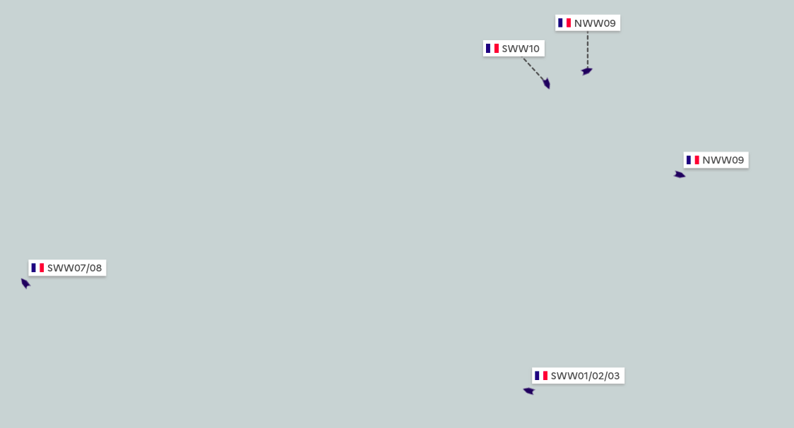

==============
Fleet segments
==============

The European Fishing Control Agency's `Guidelines on Risk Assessment Methodology <https://www.efca.europa.eu/en/content/guidelines-risk-assessment-methodology-fisheries-compliance>`_ 
define fleet segments as *'fishery units with similar fishing characteristics
(e.g., gear, area and target species)'*.

Each member state is responsible for defining the fleet segments relevant to its waters 
and to perform risk assessments on each segment.

.. _risk-assessment:

Fleet segment risk assessment and control objectives
----------------------------------------------------

In France, fleet segments were defined by the `Direction des Pêches Maritimes et de l'Aquaculture <https://agriculture.gouv.fr/administration-centrale>`_, 
and risk assessments on these fleet segments are performed each year by the 
`Directions Interrégionales de la Mer <https://fr.wikipedia.org/wiki/Direction_interr%C3%A9gionale_de_la_Mer#:~:text=Les%20directions%20interr%C3%A9gionales%20de%20la,marin%20et%20gestion%20des%20ressources>`_.

During this process, a **risk level** is computed for each fleet segment based on 

* scientific data on the **state of the stock** (healthy, threatened, collapsed...)
* national metrics to estimate the **pressure** that the fishing activity puts on the stock and the **level of non-compliance** observed on the fleet segment

This risk level represents the **impact of the fishing activity** on the ressources.

In addition, and based on the risk assessment conclusions, an objective of a minimum number of controls to perform on each fleet segment is defined.

Fleet segments definition
-------------------------

Fleet segments are defined for each year in the :doc:`back office <back-office>`, by their gears, target species, 
mesh, FAO areas, vessel types and the minimum share of target species in catches. Each segment also has an impact risk 
factor (see :doc:`risk-factor`). The segments of a new year can be initialized from those of the previous year.

The current definitions of fleet segments are published on data.gouv.fr by the :doc:`flows/controls-open-data` flow.

Fleet segments computation and display
--------------------------------------

The :doc:`flows/current-segments` flow computes the fleet segments each vessel belongs to in real time, based on ERS data.

Fishing vessels' fleet segment(s) can then be visualized on the map in real time (as vessel labels), in the 
:doc:`vessel sheet <vessel-sheet>` and in the :doc:`vessel list <vessel-list>`, where vessels can be filtered based on their fleet segments.

The fleet segments of controls are computed when the inspection report is entered (see :doc:`missions-and-controls`), and 
can be recomputed with the :doc:`flows/recompute-controls-segments` flow. The fleet segments of :doc:`prior notifications <prior-notifications>` 
are computed by the :doc:`flows/enrich-logbook` flow.

