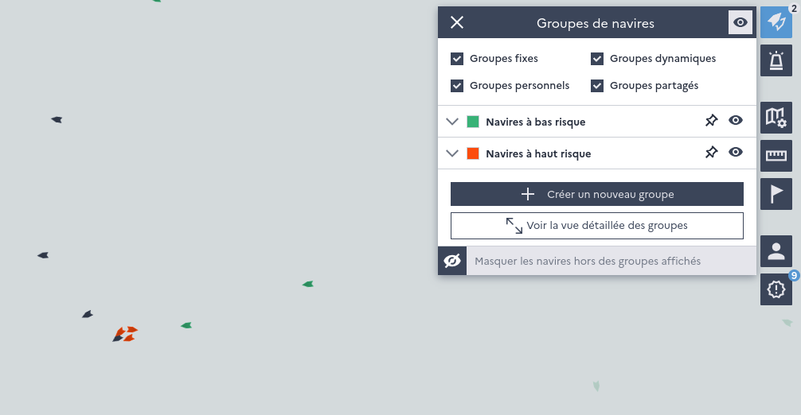

=================
Groups of vessels
=================

Groups of vessels make monitoring and targeting of fishing vessels on various criteria very flexible.

Types of groups
---------------

* **dynamic groups** are defined by criteria - the filters of the :doc:`vessel list <vessel-list>` (fleet segment, risk factor, 
  gear, producer organization, vessel size, time since last inspection, zones...). Vessels enter and leave the group as their 
  situation changes.
* **fixed groups** are lists of vessels, created from a selection in the vessel list or by importing a CSV file. Vessels can 
  be removed from a fixed group.

Each group has a name, a description, points of attention, a color and an optional validity period. Groups can be displayed 
or hidden on the map, pinned, and exported as a CSV file.

Sharing
-------

Groups created by one user can be kept private or shared with the teams of the FMC (operations for mainland France, operations 
for overseas territories, regulation and planning, SIP). Only super users can share groups.

.. _priority-groups:

Priority groups
---------------

Two groups are computed automatically by Monitorfish :

* **P1 segments** : vessels whose control priority level is *very high*
* **P2 segments** : vessels whose control priority level is *high*

The control priority level of a vessel is that of its current fleet segments (see :doc:`control-priority-steering`), 
including chartered vessels. Vessels of priority groups are highlighted on the map with a target icon.
