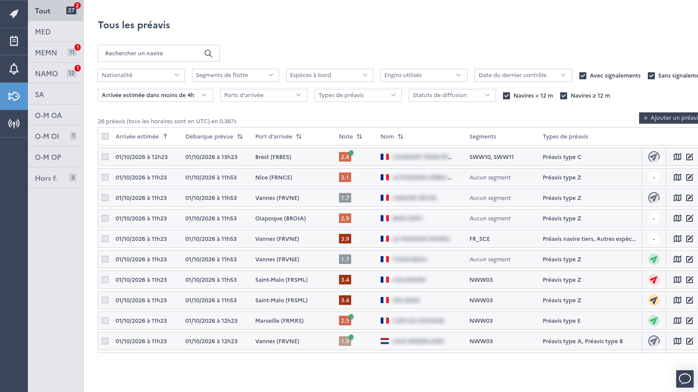

===================
Prior notifications
===================

Prior notifications (PNOs) of return to port can be monitored, checked, prioritized and sent to control units for 
targeted land inspections.

Sources of prior notifications
------------------------------

* **logbook PNOs** are sent by vessels in their electronic logbook, and received by the :doc:`flows/sales-and-logbook` flow
* **manual PNOs** are entered by FMC agents (*"Ajouter un préavis"*) for vessels which are not subject to electronic logbook, 
  with the expected catches, port and date of arrival. Manual PNOs are also displayed in the vessel's trip.

The data pipeline computes the type, :doc:`fleet segments <fleet-segments>` and :doc:`risk factor <risk-factor>` of each 
PNO (see :doc:`flows/enrich-logbook` and :doc:`flows/init-pno-types`).

List of prior notifications
---------------------------

The list of PNOs, in the side window, can be filtered by nationality, fleet segment, species, gears, date of the last control, 
port and expected time of arrival, PNO type, vessel length and sending status. A counter shows the number of PNOs to verify.

The card of each PNO shows its content, the decision of the FMC, the history of messages sent to control units and allows to 
download the PNO as a PDF document.

Verification and distribution
-----------------------------

* PNOs which are in the *verification scope* of the FMC - PNOs of vessels with a high :doc:`risk factor <risk-factor>`, 
  of foreign vessels (except some flag states) or of vessels with active :doc:`reportings` - must be verified by an FMC 
  agent before being sent. By default, the prioritization is based on the :doc:`risk factor <risk-factor>` 
  and can be overridden by FMC supervisors for specific cases.
* other PNOs are sent automatically.

PNOs are sent by email and SMS by the :doc:`flows/distribute-pnos` flow to the control units subscribed to the port, 
fleet segment or vessel (see :doc:`control-units`). A PNO can be invalidated, for instance when it was sent by mistake.

Manual "zero" PNOs of BFT and SWO are automatically invalidated after 24 hours.

Depending on the deployment, regular users can access the list of prior notifications in read only mode.
