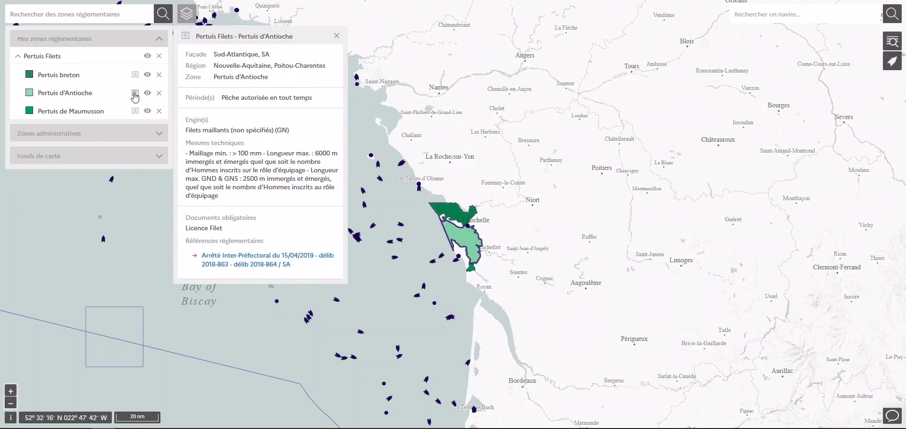

==========
Regulation
==========

A dedicated team of the FMC watches fishing regulation evolutions and captures 
it as semi-structured data in the :doc:`back office <back-office>` of Monitorfish : for each regulated area, its geometry, 
regulatory references, authorized or prohibited gears and species, fishing periods and derogations.

This data can be then displayed in Monitorfish to show regulated fishing areas (see :doc:`map-and-layers`), and is used 
by :ref:`configurable alerts <configurable-alerts>`.

The regulations data set is published and updated weekly on data.gouv.fr and on the Géoplateforme (see :doc:`flows/regulations-open-data`) : https://www.data.gouv.fr/datasets/reglementation-des-peches-cartographiee/