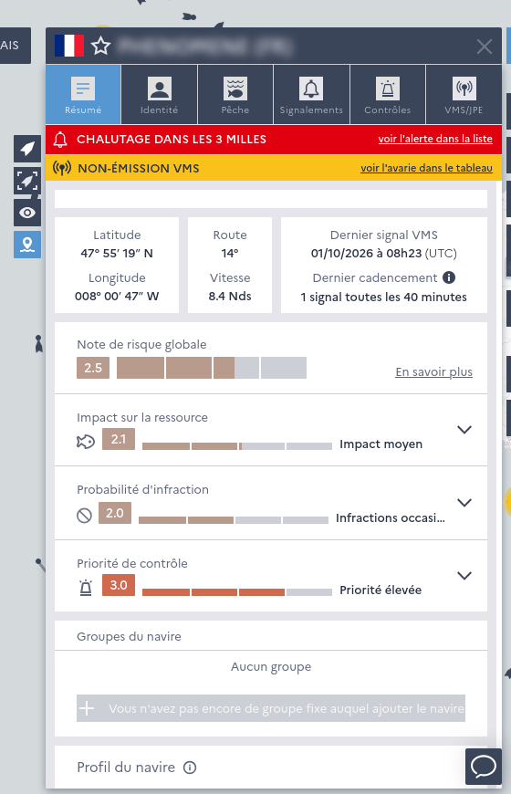
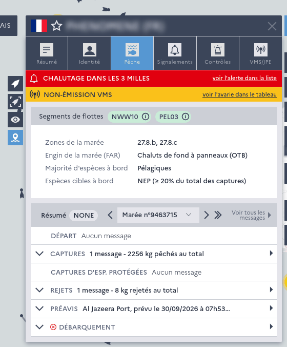
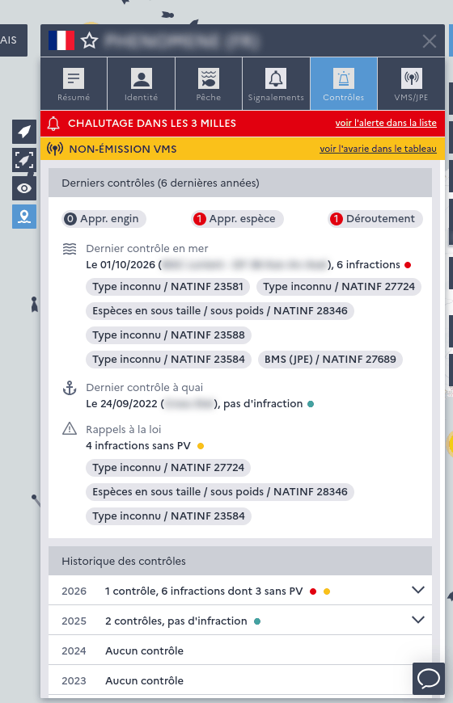

============
Vessel sheet
============

Vessel search
-------------

Vessels can be searched by name, CFR, external marking, IRCS (call sign) or MMSI, including vessels which do not emit VMS. 
Selecting a vessel opens its sheet in the sidebar and shows its track on the map.

Vessel sheet
------------

The vessel sheet has several tabs :

*Summary tab of the vessel sheet, with the alert and beacon malfunction banners and the risk factor*

* **Summary** (*"Résumé"*) : last position, current :doc:`fleet segments <fleet-segments>`, :doc:`groups <groups-of-vessels>` 
  the vessel belongs to, the vessel's usual activity over the last year (:doc:`vessel-profiles`) and, for super users, 
  a summary of its :doc:`risk factor <risk-factor>`
* **Identity** (*"Identité"*) : vessel characteristics, flag state, skipper, charter status and contact methods 
  (contact methods can be updated by super users)
* **Fishing** (*"Pêche"*) : the logbook messages of each trip (DEP, FAR, DIS, COE, COX, CRO, CPS, EOF, PNO, LAN, RTP...) with 
  a summary of catches, the manual :doc:`prior notifications <prior-notifications>` of the trip and the transmission format of messages. 
  Previous trips can be browsed, messages can be filtered, sorted, downloaded and displayed on the track.
* **Reportings** (*"Signalements"*, super users) : current :doc:`reportings`, a summary of the last 12 months and the archived reportings
* **Controls** (*"Contrôles"*) : the history of controls by year with infractions, gears and species controlled. Each control can 
  be opened in the :doc:`mission form <missions-and-controls>` (super users), and the trip during which a control took place can be displayed.
* **VMS / logbook equipment** (*"VMS/JPE"*) : VMS and logbook equipment, satellite pictures (VisioCaptures) and the history of 
  :doc:`beacon malfunctions <vms-beacon-monitoring>`

Track
-----

The track of the selected vessel can be :

* displayed over a predefined depth (e.g. 12 hours, 1 day, 3 days...) or a custom date range
* displayed with its positions, or with the logbook messages located on the track
* exported as a CSV file

AIS positions are merged into the VMS track when available.

*Fishing tab : fleet segments and logbook messages of the current trip*

*Controls tab : last controls, legal reminders and controls history*

.. _followed-vessels:

Followed vessels
----------------

Vessels can be added to the *"Mes navires suivis"* list from their sheet, to quickly find them and display their tracks. 
This list is saved for each user.
