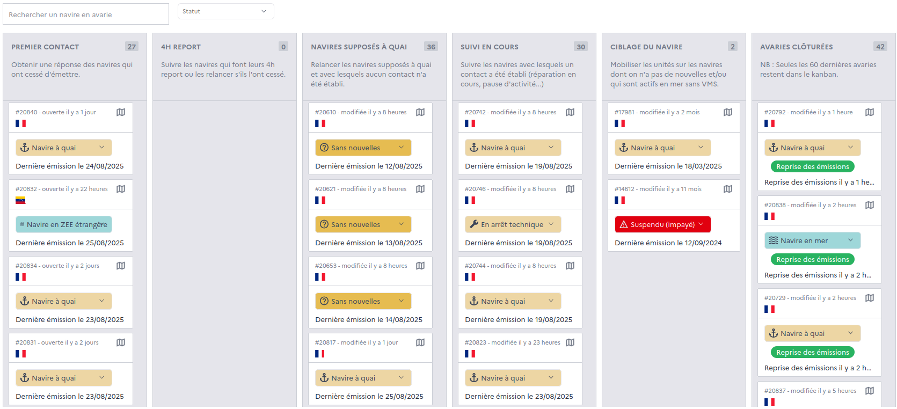

=====================
VMS beacon monitoring
=====================

A module of Monitorfish is dedicated to monitoring the emission of VMS beacons - which are required by law to emit constantly. 
When a VMS beacon censes to emit, a malfunction is generated in Monitorfish. The vessel captain and satellite operator are notified
and the malfunction can be tracked in a dedicated kanban until the malfunction is resolved.

