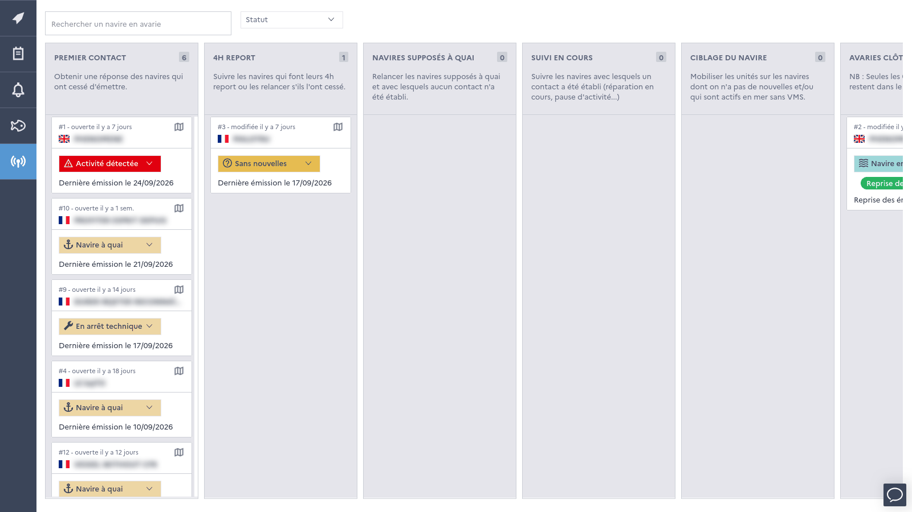

=====================
VMS beacon monitoring
=====================

A module of Monitorfish is dedicated to monitoring the emission of VMS beacons - which are required by law to emit constantly. 

When a VMS beacon ceases to emit (see :doc:`flows/update-beacon-malfunctions`), a malfunction is generated in Monitorfish. 
Malfunctions can be tracked in a dedicated kanban (*"Suivi VMS"*, super users) until the malfunction is resolved.

For each malfunction, FMC agents can :

* move it between the stages of the kanban, and update the status of the vessel (at sea, at port, activity detected...)
* add comments, and read the history of the malfunction
* send notifications to the vessel captain and operator, and to the satellite operator - initial notification, reminder, end of 
  malfunction - or notify a foreign FMC when the vessel is in foreign waters. Notifications are sent by email, SMS and fax by the 
  :doc:`flows/notify-beacon-malfunctions` flow.

The history of beacon malfunctions of each vessel is also visible in its :doc:`vessel sheet <vessel-sheet>`.
